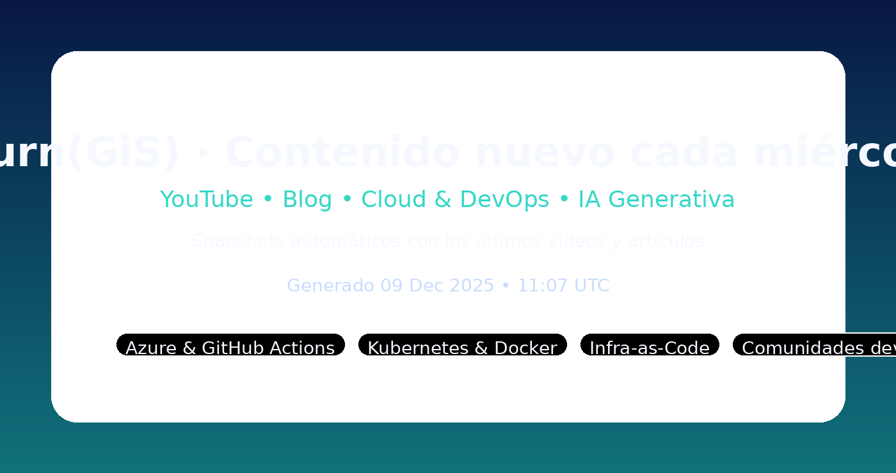

  
  <h1>¡Hola! Soy Gisela Torres 👩🏻‍💻</h1>
  
  
DevRel en Microsoft ayudando a developers a construir, automatizar y disfrutar la tecnología con historias reales.

  
<strong>Contenido nuevo cada miércoles a las 10:00 AM (CE(S)T)</strong>

  
  

---

## 👋 Presentación

Trabajo en **Microsoft** desde hace más de 11 años (¡y 18 en el sector!) como **Software Global Blackbelt** 🫶🏻. Mi misión es técnica: ayudar a los developers a ser más felices y productivos a través de la tecnología. Comparto todo lo que aprendo en [return(GiS);](https://www.returngis.net) y en YouTube [return(GiS);](https://www.youtube.com/@returngis) 🎥🍿.

---

## 🔎 En resumen
- Historias prácticas sobre Cloud, IA generativa y DevOps aplicadas en proyectos reales.
- Mentoring y tooling para que tu equipo entregue software con más calidad y menos fricción.
- Comunidad activa: charlas, demos y contenido que aterriza conceptos complejos.

> Nota importante: este README se actualiza automáticamente cada miércoles con los últimos vídeos y artículos (GitHub Actions + Node.js).

---

## ✨ Highlights rápidos
- Últimos episodios y posts siempre listos gracias a la automatización semanal.
- Enfoque “hands-on”: pipelines, infraestructura como código y observabilidad con ejemplos reales.
- De la pizarra al código: guías breves, snippets y referencias para que puedas replicar lo que cuento.

---

## 🆕 Contenido reciente

## 🎥 Mis últimos vídeos en YouTube

### [Cómo crear workflows de GitHub Actions - Tutorial completo](https://www.youtube.com/@returngis)
📅 15 de diciembre de 2024

Aprende a automatizar tu workflow con GitHub Actions paso a paso

---

### [Infraestructura como código con Terraform y Azure](https://www.youtube.com/@returngis)
📅 8 de diciembre de 2024

Domina Terraform para gestionar tu infraestructura en Azure

---

### [Docker y Kubernetes para desarrolladores](https://www.youtube.com/@returngis)
📅 1 de diciembre de 2024

Containeriza y orquesta tus aplicaciones como un profesional

---

---

## 📝 Mis últimos artículos en el blog

### [Automatización CI/CD con GitHub Actions y Azure DevOps](https://www.returngis.net)
📅 12 de diciembre de 2024

Cómo implementar pipelines eficientes para tus proyectos con las mejores prácticas de la industria.

[**📖 Seguir leyendo...**](https://www.returngis.net)

---

### [Microservicios en Azure: Arquitectura y mejores prácticas](https://www.returngis.net)
📅 5 de diciembre de 2024

Diseña sistemas escalables y resilientes en la nube con patrones modernos de arquitectura.

[**📖 Seguir leyendo...**](https://www.returngis.net)

---

### [Monitoreo y observabilidad en aplicaciones modernas](https://www.returngis.net)
📅 28 de noviembre de 2024

Herramientas y técnicas para mantener tus aplicaciones saludables y monitoreadas.

[**📖 Seguir leyendo...**](https://www.returngis.net)

---

---

## 🛠️ Stack de Tecnologías y Herramientas

### ☁️ Cloud & DevOps

  
  
  
  
  
  

### 🧠 Desarrollo Core & IA Generativa

  
  
  
  
  
  

### 🔧 Herramientas

  
  
  

---

## 🚀 Proyectos destacados

[-339933?style=for-the-badge)](https://www.returngis.net "Mi blog personal")
[-FF0000?style=for-the-badge&logo=youtube&logoColor=white)](https://www.youtube.com/@returngis "Mi canal de YouTube")

---

## 📊 Mis estadísticas

  
  

---

## 🥰 Mis intereses

🐣 &nbsp;Pasar tiempo con mi familia y amig@s
&nbsp;•&nbsp;
🚴🏼‍♀️ &nbsp;Montar en bici
&nbsp;•&nbsp;
🐕 &nbsp;Pasear a Siri
&nbsp;•&nbsp;
🌲 &nbsp;Senderismo
&nbsp;•&nbsp;
✈️ &nbsp;Viajar
&nbsp;•&nbsp;
🎬 &nbsp;Ir al cine

---

## ✉️ Contacto

¿Te gusta mi contenido? **¡Suscríbete y sígueme en mis redes sociales!** 🚀

---

💡 **¡Nuevo contenido cada miércoles!** 💡

*Este README se actualiza automáticamente con mis últimos vídeos y artículos.*

